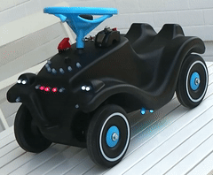
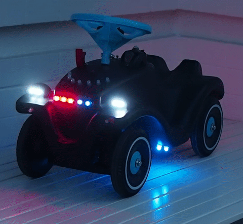
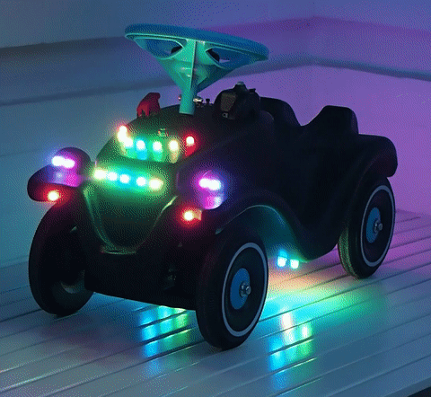
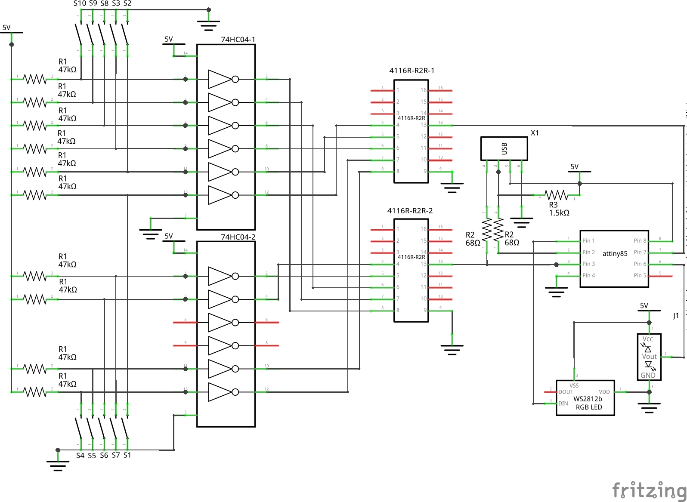
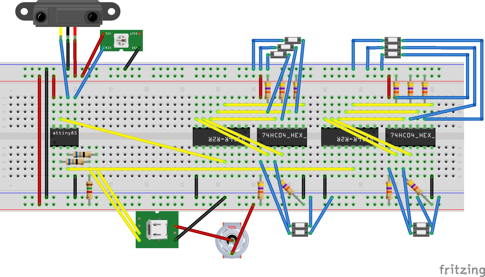
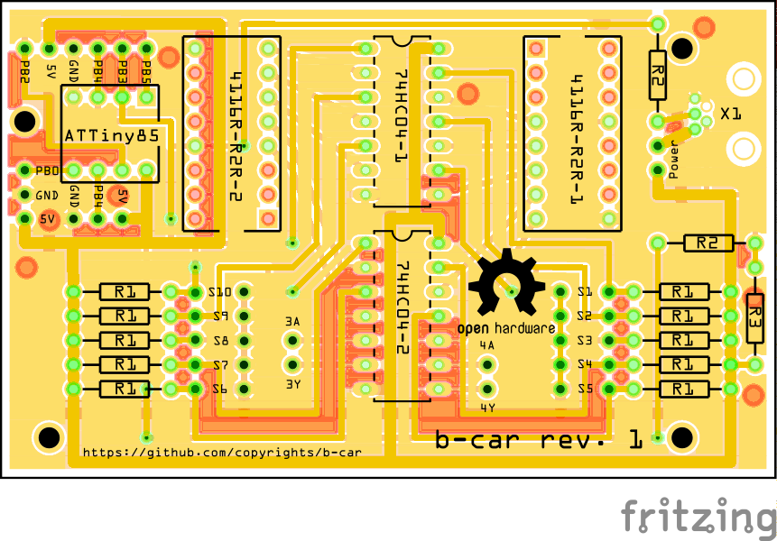
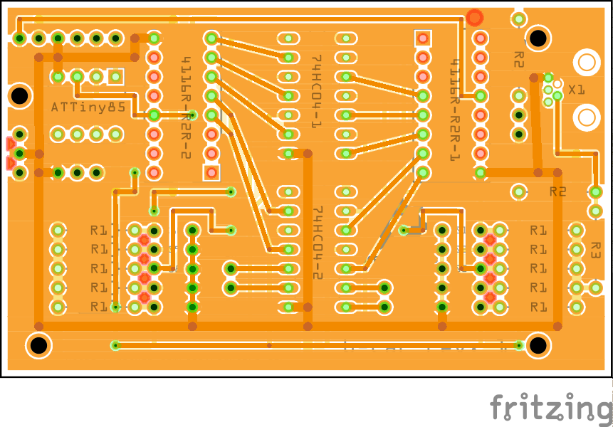
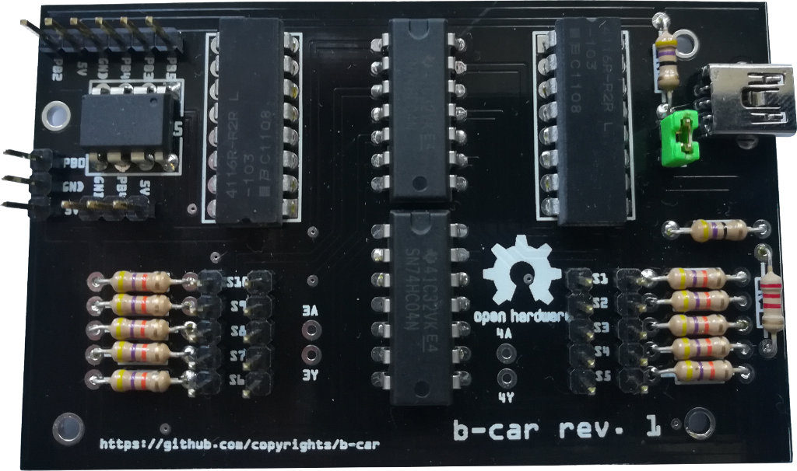

# b-car
That a classic Big Bobby Car, cut a hole in the underbody, drill some more holes, put some RGB-LEDs, buttons and a sensor through holes, place a battery and a circuit board inside and you ready to go.

   
## Features
* Knight Rider like front row
* full control
  * connect up to 10 button (+power button)
  * program via USB
  * write our own program with Arduino IDE 1.6.5+ (Arduino 1.6.5r2 - NOT 1.6.6 or 1.6.7 strongly recommended) 
* tachometer
  * three colors
  * show real speed via photo sensor at a tire
* car basics
  * low beam
  * high beam 
  * back light
  * turn lights
* flash light
* police beacon light an front flash
* rainbow mode

 
## Hardware
### Circuit 

### Bobby Car 

## Software
The b-car runs the [micronucleus tiny85](https://github.com/micronucleus/micronucleus) bootloader. 
